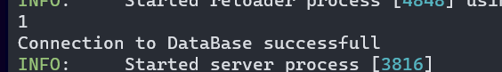

# FastAPI - Library Management System

## Project Overview

- Back-end Framework: FastAPI
- Database: PostgreSQL
- Data Validation: Pydantic
- Database Migration: Alembic
- ORM: SQLAlchemy

## Step 1. Start by cloning the repo

## Installing dependencies

    pip install -r requirements.txt

# Database Configuration

### 1. Configure Database Connection:

- Open src.entrypoint.database and update the SQLALCHEMY_URL on line [8] with your database connection details:

        SQLALCHEMY_URL = "db_driver://db_username:db_password@db_host/db_name"

- ### Also while at it update the `sqlalchemy_url` in `alembic.ini` file at line -- 63

### 2. Check Database Connection

- Run the following command:

        uvicorn src.entrypoint.main:app --reload

  

- If successful, you'll see a message in the terminal. Press ctrl + c to stop the server.

### 3. Run Database Migration:

- Run the following command
-       alembic upgrade head

# Run the server

- Run the following command to run the server:
  uvicorn src.entrypoint.main:app --relaod

Access the API Docs at localhost:8000/docs.
